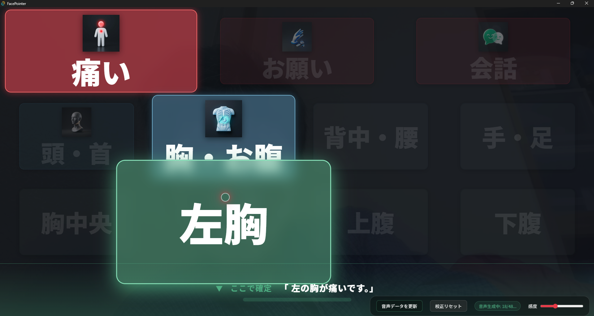

# FacePointer

FacePointerは、顔の動きだけで操作できるコミュニケーションボード（意思伝達装置）です。
発話や肢体に不自由がある方、失語症などの症状がある方が、視線やまばたき（または特定の顔のジェスチャー）で自分の意思を周囲に伝えることを目的としています。

 <!-- アイコンなどがあればここに配置 -->

## 🌟 主な機能

- **顔トラッキング:** MediaPipe FaceLandmarkerを使用した、高精度かつ低遅延な顔認識。
- **ポインタ操作:** 鼻の向きでマウスカーソル（赤いポインタ）を操作し、ボタンを選択。
- **症状モード:** 初期画面で「かゆい / 痛い」の2択を大きなボタンで表示し、口を開く操作で確定。続けて「頭 / 体 / 手 / 足」を選ぶと「頭が痛いです」のように即時発話できます。
- **3段階の階層メニュー:** 「したい事」→「具体的な動作」→「最終決定」の流れで、直感的に文章を構築。
- **確定ゾーン方式:** 画面下部の特定のエリアにポインタを置く（滞留させる）ことで決定。誤操作を防止。
- **口ジェスチャー確定:** 症状モードでは、口を開くことでホバー中のボタンを確定します。
- **最高品質の音声合成:** Google Gemini 2.5 Flash TTS (`Achernar`) に対応。非常に自然で落ち着いた日本語音声で発話をサポート。
- **音声キャッシュ (IndexedDB):** 生成した音声は保存され、2回目以降は瞬時に再生されます。
- **デスクトップアプリ化:** Tauri (Rust) を使用した軽量なWindowsデスクトップアプリとして動作。

## 🚀 インストール & 実行

### 一般ユーザー (実行・インストール)
1. [Releases](https://github.com/ohru131/FacePointer/releases) から最新の `FacePointer_x.x.x_x64_en-US.msi` をダウンロードしてインストールします。
2. または、`FacePointer.exe` を直接実行してください。

### 開発者 (ビルド方法)

このプロジェクトを自分でビルドするには、以下の環境が必要です：
- [Node.js](https://nodejs.org/) (v16以上)
- [Rust](https://rust-lang.org/) (Tauriのビルドに必要)

```bash
# 依存関係のインストール
npm install

# 開発用モデルのダウンロード
./download_models.ps1

# 開発モードで実行
npm run tauri dev

# リリースビルド (インストーラーの作成)
npm run tauri build
```

## 🎙 音声合成 (Google Gemini TTS) について
本アプリは **Google Gemini 2.5 Flash TTS** を使用して発話を行います。
初期設定として、アプリ右下の **設定ボタン (⚙️)** から「Google AI (Gemini) API Key」を入力し、保存してください。

### オフラインでの利用（重要）
1. インターネットに接続された環境で、右下の **「音声データを更新」** をクリックします。
2. アプリが階層メニューと症状モードの全文章の音声を生成し、ブラウザのキャッシュ (IndexedDB) に保存します。
3. 一度保存が完了すれば、**オフライン（病院内などネットがない場所）でも** 生成済みの高品質な音声でそのまま使い続けることができます。

※ APIキーが設定されていない、または通信エラーが発生した場合は、OS標準の日本語音声（Microsoft Nanami等）が自動的に選択されます。

## 📁 階層データのカスタマイズ
`hierarchy.txt` を編集することで、表示されるボタンの名前や階層構造を自由に変更できます。

- 開発モード (`npm run tauri dev`) では、`dist/hierarchy.txt` が初期データとして使われます。
- インストーラー版では、設定画面から保存した内容はユーザーごとの AppData 配下にある `hierarchy.txt` に保存され、次回起動時からそちらが優先されます。
- `dist/hierarchy.txt` を変更した場合は、反映のため再ビルド・再インストールが必要です。

```text
食事|media/food.png
  ごはん
    ごはんを食べたい
  パン
    パンが食べたい
```

## 🛠 技術スタック
- **Frontend:** HTML, JavaScript, CSS (Vanilla)
- **AI/ML:** [MediaPipe Vision](https://developers.google.com/mediapipe/solutions/vision/face_landmarker)
- **Backend/Desktop:** [Tauri](https://tauri.app/) (Rust)
- **Audio:** Web Audio API & Google Gemini TTS (Generative AI)

## 🎮 操作モード
- **症状モード (デフォルト):** 「かゆい / 痛い」から始めて、続けて体の部位を選ぶ2段階モードです。30秒操作がない場合は初期画面に戻ります。
- **階層モード:** 従来の3段階メニューで、お願いごとや会話文を選択できます。
- 設定画面からモードを切り替えできます。

## 📄 ライセンス
MIT License

---
Developed by [ohru131](https://github.com/ohru131)
